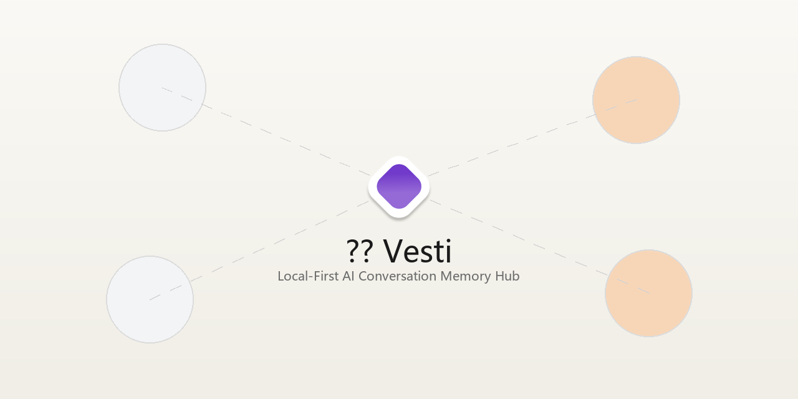
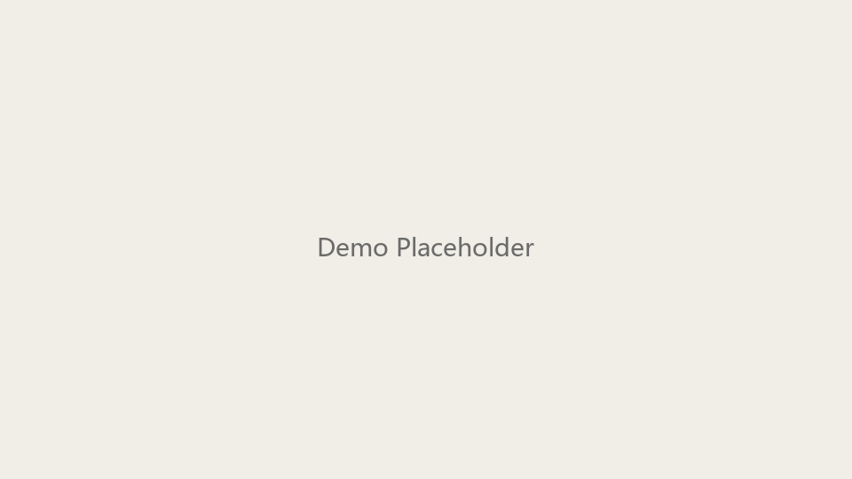
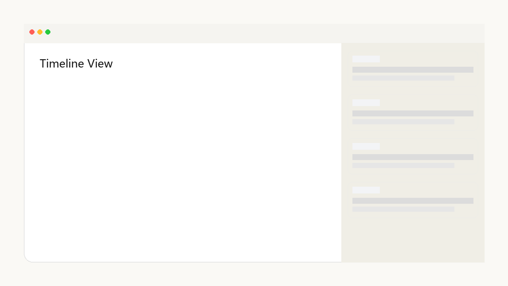
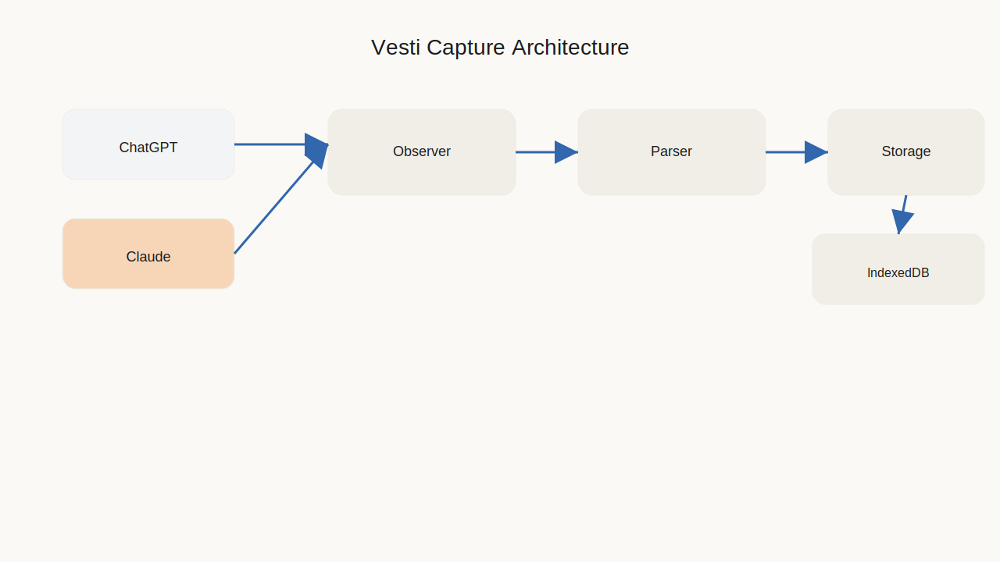

<h1 align="center" style="display:none">心迹 Vesti</h1>

<p align="center">
  
</p>

<p align="center">
  
  
  
  
</p>

## ⚡ 为什么需要心迹
心迹 Vesti 是一个本地优先的 AI 对话记忆中枢，帮助你捕获、组织并理解与 AI 的全部对话。你在 ChatGPT 探讨产品设计、在 Claude 咨询技术方案、在 Gemini 做竞品分析——这些思考碎片散落在不同平台、不同标签页里，难以回溯、无法关联、缺乏洞察。心迹让你真正拥有自己的数字思维档案。

> 核心原则：所有对话数据只保存在本地设备中，不经由任何第三方服务器。

## 🎬 Demo
<p align="center">
  
</p>

## 🖼️ 界面预览
<table>
  <tr>
    <td width="33%" align="center">
      
      <br/>Timeline View
    </td>
    <td width="33%" align="center">
      
      <br/>Reader View
    </td>
    <td width="33%" align="center">
      
      <br/>Search & Stats
    </td>
  </tr>
</table>

> 以上为高保真占位图，可替换为真实截图或 GIF。

## ✨ 核心功能
<table>
  <tr>
    <td width="50%">🛰️ <strong>实时捕获</strong><br/>在 ChatGPT / Claude 页面自动监听并写入本地 IndexedDB。</td>
    <td width="50%">🧭 <strong>统一浏览</strong><br/>Sidepanel 时间轴 + Reader 详情视图，快速回溯对话。</td>
  </tr>
  <tr>
    <td width="50%">🔎 <strong>全文检索</strong><br/>搜索标题与全文，瞬间定位关键讨论。</td>
    <td width="50%">✨ <strong>智能摘要</strong><br/>集成 ModelScope API，生成结构化摘要。</td>
  </tr>
</table>

## 🧩 技术架构
<p align="center">
  
</p>

<table>
  <tr>
    <td width="120px"><strong>Frontend</strong></td>
    <td>React 18, TypeScript, Tailwind CSS, shadcn/ui</td>
  </tr>
  <tr>
    <td width="120px"><strong>Core</strong></td>
    <td>Plasmo Framework, Dexie.js (IndexedDB)</td>
  </tr>
  <tr>
    <td width="120px"><strong>AI</strong></td>
    <td>ModelScope API (Qwen-2.5)</td>
  </tr>
</table>

## 🚀 Quick Start
### 环境要求
- Node.js 18+
- pnpm
- Chrome / Edge / Brave (Chromium 内核)

### 安装与运行（开发版）
```bash
cd "frontend"
pnpm install
pnpm dev
```
加载开发版目录：`frontend/build/chrome-mv3-dev`

### 生产构建（交付版）
```bash
cd "frontend"
pnpm build
```
加载生产版目录：`frontend/build/chrome-mv3-prod`

## 🧭 Roadmap
- [x] ChatGPT / Claude 捕获
- [x] Sidepanel（Timeline + Reader）
- [x] ModelScope 摘要（单会话）
- [ ] Gemini / DeepSeek 后端捕获
- [ ] 语义搜索与主题聚类
- [ ] 可选云同步（端到端加密）

## 📌 MVP Guide
See `documents/mvp_guide.md` for MVP 功能说明、使用步骤（Sidepanel / 实时捕获 / ModelScope 摘要）与交付指引。

## 📦 ZIP 交付物使用说明（Chrome）
1) 解压 `release/Vesti_MVP.zip` 到任意目录
2) 打开 `chrome://extensions/`
3) 开启「开发者模式」
4) 点击「加载已解压的扩展程序」
5) 选择**解压后的文件夹**（确保 `manifest.json` 在根目录）

提示：如果解压后先看到一个子文件夹，请进入该文件夹再加载，避免“套娃”错误。

---

## 🧠 产品说明（完整版）

### 本地优先的 AI 对话记忆中枢
心迹是一个 Chrome 浏览器扩展，帮助你捕获、组织和理解与 AI 的所有对话。在这个与 ChatGPT、Claude 等大语言模型共处的时代，我们的思考、创作和决策越来越多地发生在与 AI 的对话中。但这些承载着真实思维轨迹的对话记录却散落在不同平台，难以回溯、无法关联、缺乏洞察。心迹让你真正拥有自己的数字思维档案。

### 为什么需要心迹
当你在 ChatGPT 上探讨产品设计，在 Claude 上咨询技术方案，在 Gemini 上研究竞品分析时，这些思考碎片分散在不同的标签页中。一周后，当你想找回某个重要的讨论细节时，却发现自己完全记不清它在哪个平台的哪次对话里。更糟糕的是，即使找到了对话，你也很难看清这些分散的思考之间有什么关联。
心迹解决的正是这个问题。它自动捕获你在主流 AI 平台上的所有对话，存储在你的本地设备中，提供统一的时间轴浏览、全文检索和智能摘要。你的数据完全属于你自己，不经过任何第三方服务器。更重要的是，心迹为未来构建真正理解你的个性化 AI 伙伴奠定了数据基础。

### 核心功能
**实时捕获**：当你在 ChatGPT 或 Claude 页面进行对话时，心迹在后台静默工作，自动提取对话内容并存储到本地 IndexedDB。这个过程完全自动化且不可感知，无需你主动标记或导出。

**统一浏览**：在浏览器侧边栏打开心迹，你可以看到按时间排列的所有对话卡片。每张卡片显示对话标题、平台标识、时间戳和消息轮数。点击任意卡片即可进入详情视图，查看完整的多轮问答流程。

**全文检索**：通过搜索框输入关键词，瞬间定位到包含该词的所有对话。搜索不仅匹配标题，也匹配对话的完整内容，让你不再遗漏任何重要的思考片段。

**智能摘要**：集成 ModelScope API，为单个会话生成结构化摘要，快速把握对话的核心内容和关键结论。这对于回顾长对话或快速复习特定主题特别有用。

**本地优先**：所有数据存储在你的本地设备中，不上传到任何云端服务器。你拥有完整的数据主权，可以随时导出、备份或删除。即使开发者也无法访问你的对话记录。

### 技术架构
心迹采用现代化的浏览器扩展技术栈构建，确保性能、稳定性和可扩展性。

- **前端框架**：基于 React 18 和 TypeScript 开发，所有组件都有严格的类型定义，降低运行时错误。
- **样式系统**：Tailwind CSS + Vesti 色彩 Token，营造温暖克制的阅读体验。
- **扩展框架**：Plasmo 提供热重载、TypeScript 支持与优雅的 API 抽象。
- **本地存储**：Dexie.js 作为 IndexedDB 抽象层，提供类型安全的数据操作。
- **捕获引擎**：Parser-Observer-Storage 三层架构，解析与存储解耦。
- **服务层隔离**：UI 组件不直接操作数据，所有交互通过统一服务接口。

### 配置 ModelScope API
心迹的摘要功能需要调用 ModelScope 的大语言模型 API。要启用这个功能，你需要先获取 API 密钥。访问 ModelScope 官网并注册账号，在控制台创建新的 API 密钥。请妥善保管这个密钥，不要与他人分享。

在心迹的设置页面中，找到 ModelScope 配置区域。输入你的 API 密钥，并选择要使用的模型 ID。我们推荐使用 Qwen 系列模型，它们在中文理解和生成方面表现优秀。配置完成后，点击测试按钮验证连接是否成功。如果看到“连接成功”的提示，说明配置已完成。

现在你可以在任何对话详情页中点击“生成摘要”按钮，系统会调用 ModelScope API 分析对话内容并生成结构化摘要。生成的摘要会被缓存在本地，下次查看同一对话时无需重新生成。

### 使用指南
**捕获对话**：心迹目前支持 ChatGPT 和 Claude 两个平台的对话捕获。扩展会自动监听页面变化并提取对话内容，无需你手动操作。

**浏览与搜索**：侧边栏时间轴按时间倒序排列对话卡片，卡片包含标题、平台标签与轮数。搜索框支持标题与全文匹配。

**查看详情**：消息按时间正序排列，用户消息与 AI 消息背景区分；长消息支持折叠，支持一键复制。

**生成摘要**：在对话详情页点击“生成摘要”，ModelScope 分析对话并输出结构化结果。

### 数据管理
在设置页面中，你可以查看当前的存储用量。导出功能允许将所有对话记录打包为 JSON 文件，支持本地备份与迁移。清空数据会删除所有本地对话与摘要缓存，执行前会弹出确认提示。

### 当前限制与未来规划
- **平台支持**：当前仅 ChatGPT / Claude 支持捕获，Gemini / DeepSeek 仅 UI 占位。
- **同步能力**：暂无云端同步或多设备一致性。
- **AI 能力**：目前仅实现单会话摘要，更多分析能力待开放。

### 短期路线图
- 增加 Gemini / DeepSeek 后端捕获
- 引入向量化语义搜索
- 实现跨对话主题聚类
- 可选云同步（端到端加密）

### 长期愿景
心迹希望成为个性化 AI 时代的记忆基础设施。随着对话积累，系统可构建个人知识图谱，识别你的思维模式、决策偏好与知识盲区，甚至训练“只属于你的数字思维伙伴”。

### 贡献指南
心迹是开源项目，欢迎提交 Issue 或 PR。在提交代码前，请确保通过 TypeScript 类型检查并遵循项目风格规范。

### 许可证
心迹采用 MIT 许可证开源。

### 致谢
心迹使用了 Plasmo、Dexie.js、Tailwind CSS、shadcn/ui 等优秀的开源项目。感谢 Claude Code 与 Codex 在产品设计与工程实现上的协助。最重要的是，感谢每一位使用心迹的用户。心迹 Vesti —— 让思维有迹可循。
