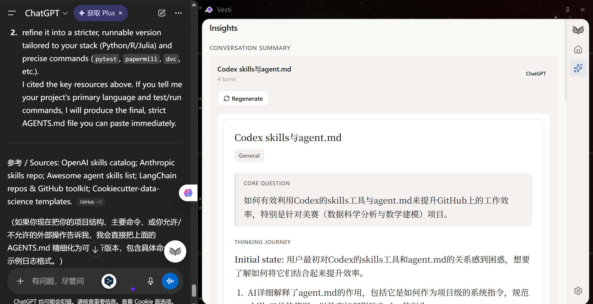
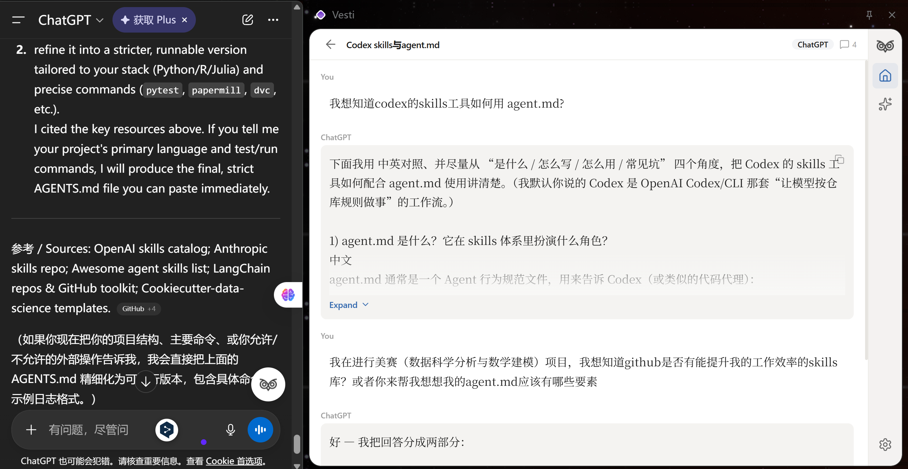
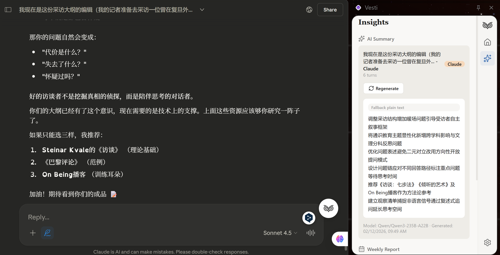
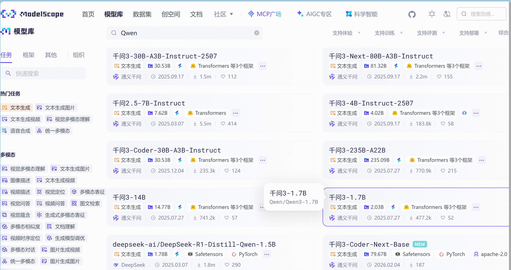
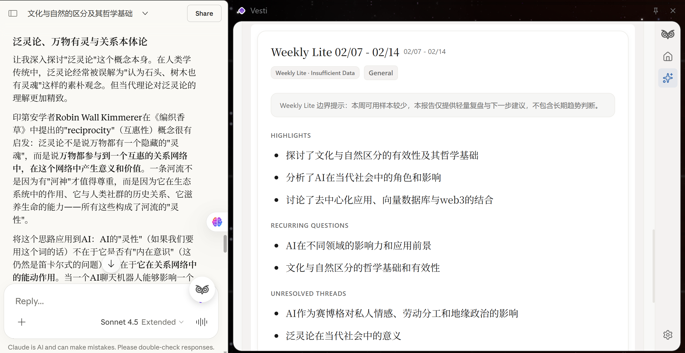

<div align="center">

  <h1>心迹 Vesti</h1>
  <p>本地优先的AI对话记忆中枢 | Local-First AI Conversation Memory Hub</p>

  <h3>📷 Vesti 界面概览与核心功能演示</h3>

  <table border="0" width="100%" cellspacing="0" cellpadding="10">
    <tr>
      <td width="50%" align="center" valign="top">
        
        <br>
        <sub><b>沉浸式侧边栏 (右侧)</b><br>在浏览网页时，随时呼出记录灵感与摘要。</sub>
      </td>
      <td width="50%" align="center" valign="top">
        
        <br>
        <sub><b>全局对话管理 (左侧)</b><br>集中管理所有平台的 AI 对话历史，一键回溯。</sub>
      </td>
    </tr>
    <tr>
      <td width="50%" align="center" valign="top">
        
        <br>
        <sub>🤖 <b>ChatGPT：即时结构化笔记</b><br>无缝跟随对话流，自动提取要点生成清晰摘要。</sub>
      </td>
      <td width="50%" align="center" valign="top">
        
        <br>
        <sub>🧠 <b>Claude：深度思维路径可视化</b><br>梳理长文脉络，呈现核心问题与思考演进过程。</sub>
      </td>
    </tr>
  </table>

  <br>
  
  https://github.com/user-attachments/assets/9f3f04a6-4abd-4d46-bcb5-b0d12e1b732f

  <b>🎥 视频演示：捕获对话与其他试验功能</b>

  <br><br>

  
  
  
  

</div>

---

## ⚡ 为什么我们需要心迹

在这个与AI共处的时代，我们的思考方式正在发生深刻的变化。与ChatGPT、Claude等大语言模型的对话已经不再是简单的信息查询，而是成为了思考、创作和决策的核心过程。我们在AI的协助下探索新概念、推演复杂问题、打磨创意方案、澄清模糊直觉。这些对话承载着我们最真实的思维轨迹——那些尚未成型的想法、反复权衡的选择、顿悟的瞬间。

但是，现有的AI平台生态存在着一个根本性的异化。我们创造了数据，却从未真正拥有它。

### 数据封建主义的困境
目前的互联网生态本质上是一种WEB 2.0的数字封建制。AI平台是领主，掌握着数据的所有权和解释权。你在ChatGPT上探讨的产品架构、在Claude上咨询的技术方案、在Gemini上研究的市场分析——这些思考成果在法律和技术层面都不属于你，而属于OpenAI、Anthropic、Google。

这种所有权的异化带来了一系列问题。首先是数据散落。你的思考碎片被锁在不同平台的围墙花园里，微信的数据不会被百度抓取，ChatGPT的历史记录无法导出到Claude。当你需要回溯某个想法时，你必须记得它发生在哪个平台的哪次对话里，否则就永远找不到了。其次是解释权的丧失。平台通过推荐算法和年度总结定义了"什么是重要的"，但这个标准是为了优化平台的商业目标而设计的，而非服务于你的自我理解。你看到的年度报告告诉你"听了多少首歌""聊了多少次天"，但它无法回答"这些对话在你的思想演进中扮演了什么角色"。

更深层的问题是思维叙事权的缺失。人类通过叙事定义自己，我们需要能够回顾过去、看清思维的轨迹、理解今天的自己如何从昨天的困惑中走来。但当思考过程都发生在与AI的对话中，而这些对话又散落在不同平台、难以整合、缺乏洞察时，我们实际上失去了为自己的思维写传记的能力。我们拥有数据的碎片，却失去了叙事的完整性。

### 注意力主权与意义的关系性
心迹的第一个核心信念是：注意力主权先于数据主权。真正的主权不仅在于"我拥有我的数据"，更在于"我定义什么数据能代表我"。这意味着我们不试图记录用户的所有数字活动——那会导致信号被噪音淹没。相反，我们提供工具让用户主动或智能地选择什么值得被记住。

这个理念源自一个深刻的认识：在信息过载的时代，意义不在于占有更多数据，而在于识别什么是真正重要的。你可能一周内在多个AI平台上进行了五十次对话，但其中真正承载思考深度的可能只有五次。如果系统盲目地给所有对话同等权重，反而会模糊真正的信号。因此，心迹的设计从一开始就围绕"帮助用户定义自己的意义标准"展开。

心迹的第二个核心信念是：意义是关系性的而非本质性的。一个想法的重要性不来自于它本身，而来自于它与其他想法的关联。当你在不同时间、不同平台上反复讨论某个主题时，这些讨论片段在孤立状态下可能只是零散的问答，但当它们被串联起来时，就会显现出一个完整的思考演进轨迹。这就是为什么我们的架构设计从一开始就为跨对话的语义关联预留了空间——我们不仅要记录思考的快照，更要揭示思考的动态过程。

心迹的第三个核心信念是：技术应该增强而非替代人的判断。AI的角色不是告诉用户"你应该关注什么"，而是帮助用户看清"你实际上在关注什么"。系统通过学习用户的策展模式、观察用户的行为偏好，可以逐步承担起识别潜在重要内容的工作，但最终的决定权始终在用户手中。这是一种协作式的智能——AI提供建议，人做出选择，然后AI从选择中继续学习，形成一个正向的反馈循环。

### 从工具到伙伴的演进愿景
心迹的长期目标不是成为一个功能丰富的工具，而是演化为一个真正理解用户的思维伙伴。当你积累了数百上千个对话记录后，这些数据本身就构成了一个关于你的丰富知识图谱。通过向量化和语义分析，系统可以识别出你独特的思维模式、决策偏好、知识盲点。它可以在恰当的时机主动推送相关的历史思考，让你的当前探索能够站在过去经验的肩膀上。它可以揭示那些你自己都没有意识到的认知偏好和思维习惯，帮助你更好地理解自己。

这不是科幻，而是基于现有技术的可实现愿景。关键在于建立正确的数据基础设施和设计哲学。心迹的MVP阶段看似功能简单——只是捕获对话、提供搜索、生成摘要——但我们的每一个技术决策都在为这个长期愿景铺路。本地优先的架构确保了数据主权，服务层隔离的设计为未来引入向量数据库预留了接口，提示词的版本化管理让我们可以持续优化AI的理解能力。我们不是在搭建一个demo，而是在建造一个可以持续生长的系统。

---

## ⭐ 核心功能

心迹当前的能力聚焦于数据捕获和基础组织，这些是构建个性化AI记忆层的必要基础设施。

* **实时捕获**：当你在ChatGPT或Claude页面进行对话时，心迹在后台静默工作，自动提取对话内容并存储到本地IndexedDB。这个过程完全自动化且不可感知，无需你主动标记或导出。捕获的对话包含完整的多轮问答内容、时间戳、平台标识等元数据。每个对话会被分配一个唯一的ID，系统能正确识别并避免重复存储。
* **统一浏览**：在浏览器侧边栏打开心迹，你可以看到按时间排列的所有对话卡片。每张卡片显示对话标题、平台标识、时间戳和消息轮数。将鼠标悬停在卡片上，会展开显示对话的前100字摘要以及快捷操作按钮。点击卡片进入详情视图，查看完整的对话历史。
* **全文检索**：通过搜索框输入关键词，瞬间定位到包含该词的所有对话。搜索不仅匹配标题，也匹配对话的完整内容，让你不再遗漏任何重要的思考片段。你还可以按平台筛选，比如只查看来自ChatGPT的对话。
* **智能摘要**：集成ModelScope API，为单个会话生成结构化摘要。这不是简单的内容压缩，而是基于精心设计的提示词工程，能够揭示对话的思维轨迹、关键转折和核心洞察。摘要包含核心问题、思考演进、关键洞见、悬而未决的话题和可行的下一步建议。生成的摘要会被缓存在本地，下次查看同一对话时无需重新生成。
* **周度思维复盘（Weekly Lite）**：每周结束时，心迹可以生成一份轻量级的思维周报，帮助你回顾这一周与AI的对话主题分布。Weekly Lite版本专注于快速识别你的关注焦点——哪些话题占据了你的思考时间，哪些问题是你反复探讨的，以及这周新涌现的兴趣点。这个功能在对话样本较少时依然能提供有价值的复盘视角，让你不会因为忙碌而失去对自己思维方向的感知。系统会自动评估本周对话样本的充分性，如果对话数量较少或讨论深度不足，会明确标注"Insufficient Data"边界提示，保持分析的诚实性而非过度推测。
* **本地优先**：所有数据存储在你的本地设备中，不上传到任何云端服务器。你拥有完整的数据主权，可以随时导出、备份或删除。即使开发者也无法访问你的对话记录。这不仅是技术选择，更是价值立场——我们相信数据应该服务于人，而非被用来分析和操纵人。

## 🧩 技术架构

心迹的技术实现体现了我们对可持续性和可扩展性的重视。每一个架构决策都不是为了快速搭建原型，而是为了建造一个可以持续演进的系统。

* **前端框架**：基于React 18和TypeScript开发，所有组件都有严格的类型定义。我们拒绝使用any类型，确保编译时就能发现绝大多数潜在错误。UI层采用shadcn/ui组件库，这不仅保证了视觉一致性，更重要的是它基于Radix UI的无障碍设计理念，确保产品对所有用户友好。
* **样式系统**：使用Tailwind CSS实现utility-first的样式架构。我们设计了完整的设计令牌系统（design tokens），包括色彩、间距、圆角、阴影等。这个系统不仅服务于当前的UI，更是为未来的功能扩展提供了一致的视觉语言。我们遵循Warm Paper设计哲学——界面像一本排版精良的学术笔记，温暖而克制，让内容成为主角。
* **扩展框架**：采用Plasmo作为Chrome扩展的开发框架。Plasmo提供了热重载、TypeScript支持和更优雅的API抽象，大幅提升了开发效率。更重要的是，它的声明式配置让我们可以专注于业务逻辑，而不是与浏览器扩展的底层API搏斗。
* **本地存储**：使用Dexie.js作为IndexedDB的抽象层，实现了类型安全的数据操作和高效的查询性能。我们设计了明确的数据模型——Conversation表存储对话元数据，Message表存储具体消息内容，Summary表缓存生成的摘要。所有表之间通过外键关联，保证数据一致性。
* **捕获引擎**：设计了Parser-Observer-Storage三层架构。Observer层使用MutationObserver监听DOM变化，当检测到新消息时触发解析流程。Parser层根据平台特性提取对话内容——不同AI平台的DOM结构差异巨大，我们采用了主备选择器策略，每个平台定义多个可能的选择器模式，运行时动态检测哪个有效。这种设计让系统对平台UI更新具有弹性。Storage层负责数据持久化，使用debounce机制和增量更新策略，将数据库操作减少了80%以上。
* **服务层隔离**：这是架构设计中最关键的决策之一。UI组件永远不直接操作数据，所有交互通过统一的服务接口进行。这意味着当我们未来引入向量数据库或云端同步时，只需要重写服务层的内部实现，UI层完全不需要改动。我们甚至在MVP阶段就设计了mockService作为开发和测试的替身，验证了这个隔离策略的有效性。
* **提示词工程**：我们为每个AI功能设计了专门的提示词模板，并建立了完整的版本管理系统。每个提示词都有明确的版本号、创建日期和变更描述。当前生产环境使用的是v1.0版本，我们同时维护了experimental分支用于测试新的提示策略。每次调用API时都会记录提示词版本、token消耗、延迟和用户满意度，这些数据为持续优化提供了基础。提示词的设计遵循一个核心原则：AI不是冷冰冰的摘要生成器，而是善于洞察思维轨迹的观察者。我们要求AI关注对话的过程而非仅仅是结论，识别隐含的意图和情绪，把对话放在更大的语境中理解。
* **双模型容错策略**：为了确保生成功能的稳定性，我们实现了双模型fallback机制。主模型是DeepSeek-R1-Distill-Qwen-14B，备用模型是Qwen3-14B。当主模型调用失败时（网络超时、速率限制、服务器错误），系统会自动切换到备用模型重试。我们还实现了多级fallback链——首先尝试json_mode结构化输出，如果返回空内容则降级到prompt_json模式，最后兜底为fallback_text纯文本输出。这确保了即使在最差情况下，用户也能得到可读的分析结果。

<table>
  <tr>
    <td width="120px"><strong>Frontend</strong></td>
    <td>React 18, TypeScript, Tailwind CSS, shadcn/ui</td>
  </tr>
  <tr>
    <td width="120px"><strong>Core</strong></td>
    <td>Plasmo Framework, Dexie.js (IndexedDB)</td>
  </tr>
  <tr>
    <td width="120px"><strong>AI</strong></td>
    <td>ModelScope API (DeepSeek-R1 / Qwen3 双模型容错)</td>
  </tr>
  <tr>
    <td width="120px"><strong>Design</strong></td>
    <td>Warm Paper Theme, Serif Reading Typography</td>
  </tr>
</table>

---

## 🚀 快速开始

我们提供两种安装方式：离线安装包（适合快速体验）和开发者构建（适合贡献代码）。

### 方式一：离线安装包（推荐）

无需配置编程环境，三步即可体验心迹。请先访问以下任一项目主页下载最新版本的安装包：

<div align="center">
  <a href="https://vesti-landing-page0211.vercel.app/">
    
  </a>
  <a href="https://modelscope.cn/studios/aurorasein/Vesti/summary">
    
  </a>
</div>

<br>

**安装步骤：**
1. 解压安装包到本地任意位置，确保能直接看到 `manifest.json` 文件。注意安装完成后请勿删除或移动该文件夹。
2. 在 Chrome 浏览器地址栏输入 `chrome://extensions/` 进入扩展管理页，开启右上角的"开发者模式"开关。
3. 点击左上角的"加载已解压的扩展程序"按钮，选择解压后的文件夹。

> 安装成功后，Vesti 图标将出现在浏览器工具栏中。现在打开 ChatGPT 或 Claude 网页开始对话，心迹会自动捕获并生成记忆胶囊。

### 方式二：开发者构建

如果你想贡献代码或深度定制，可以从源码构建。
**环境要求**：Node.js 18 或更高版本，pnpm 包管理器。

**构建步骤：**

```bash
# 克隆仓库
git clone [https://github.com/yourusername/vesti.git](https://github.com/yourusername/vesti.git)
cd vesti

# 安装依赖
cd frontend
pnpm install

# 开发模式（热重载）
pnpm dev

# 或生产构建
pnpm build
```
开发模式下，扩展文件在 `frontend/build/chrome-mv3-dev` 目录。生产构建在 `frontend/build/chrome-mv3-prod` 目录。按照方式一的步骤 2-3 加载对应目录即可。

### ⚙️ 配置 ModelScope API

心迹的摘要功能需要调用 ModelScope 的大语言模型 API。

**获取 API 密钥：**
1. 访问 ModelScope 官网并注册账号。
2. 点击右上角头像进入「个人中心」→「访问令牌」。
3. 复制以 `sdk_` 或 `ms_` 开头的字符串。

**在心迹中配置：**
1. 点击心迹设置图标进入设置页面。
2. 在 ModelScope 配置区域填入 API Key。
3. Model ID 填写推荐的模型（如 `Qwen/Qwen2.5-Coder-32B-Instruct`）。
4. 点击 **Test** 按钮验证连接。

> **💡 提示：**
> 配置成功后，你可以在任何对话详情页点击"生成摘要"按钮，系统会调用 API 分析对话并生成结构化摘要。生成的摘要会被缓存在本地，下次查看时无需重新生成。

***

| 阶段 | 核心动作 | 具体路径 / 参数 |
| :--- | :--- | :--- |
| **构建与加载** | 选择扩展目录 | **开发模式**：`frontend/build/chrome-mv3-dev`<br>**生产模式**：`frontend/build/chrome-mv3-prod` |
| **获取 API** | 在官网获取令牌 | 注册登录 ➔ 个人中心 ➔ 访问令牌 ➔ 复制 (`sdk_` / `ms_` 开头) |
| **插件内配置** | 填入设置信息 | 进入设置 ➔ 填入 API Key ➔ 填入 Model ID ➔ 点击 Test |
| **日常使用** | 生成对话摘要 | 对话详情页 ➔ 点击"生成摘要"（结果自动本地缓存） |

#### 附录：如何查找其他模型 ID？

如果你想尝试其他模型，可以在 ModelScope 的模型库中搜索。请确保复制的是形如 `组织名/模型名` （英文）的完整 ID 格式。

<div align="center">
  
  <br><sub>参考：在模型库列表中查找模型 ID</sub>
</div>

## 📖 使用指南

### 捕获对话
心迹目前支持 **ChatGPT** 和 **Claude** 两个平台的对话捕获。当你在这两个网站上进行对话时，扩展会自动监听页面变化并提取对话内容。你不需要做任何主动操作，一切都在后台自动完成。

捕获的对话包含完整的多轮问答内容、时间戳、平台标识等元数据。每个对话会被分配一个唯一的UUID（基于平台的原始会话ID），即使你在不同时间访问同一个对话页面，系统也能正确识别并避免重复存储。

> **注**：Gemini和DeepSeek虽然在界面上有占位符按钮，但MVP版本暂时不支持这两个平台的后端捕获。这是刻意的设计决策，目的是聚焦资源打磨核心体验。后续版本会逐步添加更多平台支持。

### 浏览与搜索
点击浏览器工具栏上的心迹图标，或者通过侧边栏快捷方式，可以打开心迹面板。默认页面是**时间轴视图**，显示所有捕获的对话按时间倒序排列。每张对话卡片包含标题、平台标签、时间戳和消息轮数。

将鼠标悬停在卡片上，会展开显示对话的前100字摘要，以及编辑、打开原页面、删除等快捷操作按钮。点击卡片本身会进入详情视图，显示完整的对话历史。

在顶部搜索框中输入关键词，可以实时过滤对话列表。搜索支持**标题匹配**和**内容全文匹配**，结果会高亮显示匹配的文字。你还可以点击平台标签进行筛选，比如只查看来自ChatGPT的对话。

### 查看详情
在对话详情页中，消息按时间正序排列，用户消息和AI消息通过不同的背景色区分。长消息支持智能折叠，超过500字符的内容会自动收起，显示"展开全文"按钮。

将鼠标悬停在任意消息上，右上角会出现**复制**按钮，一键复制消息内容到剪贴板。如果消息中包含代码块，会自动应用等宽字体和语法高亮。

详情页顶部的标题栏包含返回按钮、对话标题、平台标签和消息轮数统计。点击平台标签旁边的跳转图标，可以在新标签页中打开对话的原始网页，方便你继续讨论或查看更多上下文。

### 生成单会话摘要
在配置好 ModelScope API 后，对话详情页会显示"生成摘要"按钮。点击该按钮，系统会将完整的对话历史发送给大语言模型，基于我们精心设计的提示词生成结构化分析。

生成的摘要包含五个核心部分：
1. **核心问题**：用一句话概括这次对话试图回答的问题。
2. **思维演进**：从最初的困惑到最终的理解，中间经历了哪些关键转折。
3. **核心洞见**：这次对话中最有价值的认知收获。
4. **悬而未决的话题**：对话中提到但未深入探讨的问题。
5. **可行的下一步**：基于这次对话，你可能需要做的后续思考或行动。

摘要生成通常需要几秒到十几秒。生成的摘要会被缓存在本地数据库中，与对话记录关联存储。下次打开同一对话时，摘要会直接显示，无需重新生成。如果你认为摘要不够准确，可以点击重新生成按钮刷新内容。

### 查看周度摘要
在侧边栏导航到 **Insights** 页面，你可以生成周度思维复盘。选择时间范围（默认为上周一到周日），点击"生成Weekly Lite"按钮。系统会分析这一周内捕获的所有对话，提取关键信息并调用ModelScope API生成结构化的周报。

<div align="center">
  
  <br>
  <sub>📅 Weekly Lite：快速回顾一周思维轨迹，即使数据较少也能提供轻量级复盘</sub>
</div>

心迹会自动评估本周对话样本的充分性。如果对话数量较少（通常少于三个有效会话）或讨论深度不足，系统会生成 **Weekly Lite** 版本——这是一个简化但依然有用的周报。Weekly Lite版本会明确标注 "Insufficient Data" 边界提示，让你知道这周的分析基于有限样本，因此不包含长期趋势判断。这个设计避免了在数据不足时生成过度推测的内容，保持分析的诚实性。

生成的周报包含几个核心部分：**Highlights**（概括这周主要话题）、**Recurring Questions**（反复思考的问题）、**Unresolved Threads**（未深入的话题）、**Suggested Focus**（前瞻性建议）。如果样本充足，还会包含 **Evidence**（支撑分析的具体对话引用）。

### 数据管理
在**设置页面**中，你可以查看当前的存储用量。心迹显示已使用的空间大小和浏览器分配的总配额，帮助你评估是否需要清理旧数据。

* **导出数据**：允许你将所有对话记录打包为JSON格式文件，下载到本地。这个功能主要用于数据备份或迁移到其他设备。导出的JSON文件包含完整的对话内容、元数据和时间戳，可以被其他工具读取和分析。
* **清空数据**：会删除所有本地存储的对话记录和缓存的摘要。这是一个危险操作，执行前会弹出二次确认对话框。如果你想重新开始或者测试空白状态的界面，可以使用这个功能。

---

## 🧭 当前限制与清晰的演进路径

心迹当前处于黑客松 MVP 阶段，这意味着我们刻意选择了一个狭窄但深入的切入点来验证核心假设。这些限制不是技术能力不足，而是资源聚焦的战略选择。更重要的是，我们为每一个限制都设计了清晰的演进路径。与大多数黑客松项目结束后就悄然无声不同，心迹拥有明确的技术路线图和持续优化的承诺。

### MVP 阶段的边界

* **平台支持的限制**：当前版本只支持ChatGPT和Claude的实时捕获，Gemini和DeepSeek仅保留了UI占位符。这个决策背后的考量是：与其做十个平台的浅层集成，不如把两个主流平台的捕获逻辑打磨到极致。我们花费了大量时间设计Parser的主备选择器策略、增量更新机制和错误恢复流程，确保即使平台更新UI，系统也能保持弹性。这套经过验证的捕获引擎可以在未来快速复制到其他平台。
* **数据同步的限制**：所有数据都存储在本地浏览器中，不提供云端备份或多设备同步功能。这不仅是MVP阶段的简化，更是我们对数据主权承诺的体现。本地优先（Local-First）是心迹的核心设计哲学，即使未来提供云端同步，也会采用端到端加密方案，确保服务器端无法解密查看用户数据。这个架构选择让我们可以在保护隐私的前提下逐步添加便利功能。
* **AI 功能的限制**：当前实现了两个核心能力——单会话摘要和Weekly Lite周度复盘。这两个功能都建立在精心设计的提示词工程之上，能够生成结构化的、富有洞察力的分析报告。但我们清楚地知道，这距离"真正理解用户"的愿景还有很长的路要走。更高级的功能——比如跨对话的语义聚类、长时间跨度的思维演化追踪、主动的相关历史推送、个性化的思维模式分析——都需要引入向量数据库、构建语义索引、训练个性化的意义识别模型。这些能力已经在我们的技术架构中预留了清晰的扩展路径，服务层隔离的设计确保了未来添加这些功能时不需要重写UI层。
* **提示词的迭代空间**：当前使用的是v1.0版本的提示词模板，它们能够生成有用的摘要，但还远未达到最优。我们建立了完整的提示词版本管理系统，每次调用都会记录token消耗、延迟和用户满意度（如果用户提供反馈的话）。这些数据将指导我们持续优化提示词策略。我们同时维护了experimental分支，用于测试更激进的提示设计——比如引入few-shot示例、调整输出结构、增强情感敏感度。这种版本化管理让我们可以在不破坏生产环境的前提下持续实验。
* **Weekly 的边界限制**：当前的Weekly Lite版本有明确的功能边界——只分析最近七天的对话，不进行长期趋势判断。当对话样本少于三个时，系统会明确标注"Insufficient Data"并降级到轻量复盘模式。这种诚实的边界设定不是能力不足，而是产品成熟度的体现。我们拒绝在数据不充分时给出过度自信的分析，这比生成看起来专业但实际上基于薄弱基础的报告更负责任。未来的Weekly Digest完整版将提供跨周对比、主题演化追踪和动量评估，但这需要用户积累足够多的对话历史作为基础。

### 清晰的技术演进路线

我们的演进路线不是模糊的愿景，而是基于当前架构的自然延伸。每一步都有明确的技术路径和优先级排序。

#### 第一阶段（未来1-2个月）：平台扩展与稳定性强化
完成Gemini和DeepSeek的后端捕获实现。这不需要重新设计架构，而是复用现有的Parser-Observer-Storage三层模型，为新平台编写专门的选择器配置和内容提取逻辑。我们会引入自动化的选择器测试框架，当平台更新UI时能够快速检测失效并修复。
同时强化提示词的稳定性和多样性。我们会收集早期用户的反馈，分析哪些摘要被认为有价值、哪些被忽略或重新生成。基于这些数据优化提示词模板，可能会针对不同类型的对话（技术讨论、产品设计、创意写作）使用不同的提示策略。我们还会测试更长的context window，看是否能在Weekly Digest中引入更多的历史背景。

#### 第二阶段（未来3-4个月）：引入本地向量化能力
这是架构演进的关键一步。我们会为所有对话内容生成语义向量，使用Embedding API（如OpenAI的text-embedding-3-small或国内模型）将文本转换为高维向量表示。这些向量会被存储在本地的向量数据库中（可能使用LanceDB或自建基于IndexedDB的向量索引）。
向量化开启了真正的语义搜索。当你搜索"产品设计"时，系统不再局限于关键词匹配，而是能找到所有讨论用户体验、交互逻辑、功能规划的相关对话，即使它们没有直接提到"产品设计"这个词。更重要的是，向量化是实现跨对话主题聚类的基础。通过计算向量相似度，我们可以识别出你在不同时间、不同平台上反复讨论的核心议题。

#### 第三阶段（未来4-6个月）：Weekly Digest完整版与主动洞察
基于向量化能力，我们会推出Weekly Digest的完整版本。它不再只是列举这周讨论的话题，而是能够自动聚类——识别出表面不同但实质相关的讨论，将它们归为同一主题。它会追踪主题的演化轨迹，描述某个话题在一周内如何从模糊探索演变为清晰方案。它会识别跨对话的洞察——那些单看一个对话看不出来，但把多个对话放在一起就会显现的思维模式。
更激进的功能是主动洞察推送。当你在ChatGPT上开始讨论某个话题时，系统检测到这个话题与你三个月前的某次深度讨论高度相关，会在侧边栏轻轻提示"你之前也思考过这个问题，要回顾一下吗？"点击后系统会提取那次对话的关键片段，形成上下文摘要。这不是打断，而是赋能——让你的当前思考能够站在过去经验的肩膀上。

#### 第四阶段（未来6-12个月）：思维模式分析与可视化
当用户积累了足够多的对话历史后，我们可以进行更深层的元认知分析。通过NLP技术分析对话行为——你是如何提问的（开放式探索 vs 封闭式验证）、如何回应AI的建议（直接采纳 vs 批判性追问）、在面对选择时优先考虑什么（可行性 vs 理想性）。这些行为模式会被可视化展示，可能是一个雷达图展示不同维度的思维特质，或者是一个时间线展示某个特质的演化。
我们还会引入主题图谱的可视化。不再是线性的时间轴，而是一个交互式的知识网络。每个节点代表一个主题聚类，节点的大小反映你在这个主题上的投入程度，节点之间的连线表示主题间的关联强度。这个图谱会动态演化，让你直观地看到自己的思维地形图。

### 长期愿景：个性化 AI 伙伴
这些阶段性的功能升级最终指向一个统一的愿景：让心迹成为真正理解你的个性化AI伙伴。当你积累了数千个对话记录、系统识别了你的思维模式、构建了你的主题图谱后，我们可以训练一个完全基于你个人数据的语言模型（或者至少是一个高度个性化的prompt template）。
这个模型不仅记得你说过什么，更理解你为什么这么说、你的思维习惯是什么、你在某类问题上容易遇到什么困难。当你与通用AI对话时遇到瓶颈，可以切换到个性化模式，这个模式下的AI会基于你的历史思考给出更贴合你认知风格的建议。它不会简单地重复标准答案，而是会说"基于你之前在XX问题上的思考方式，这次你可能需要从YY角度切入"。
这不是科幻，而是技术上完全可行的路径。关键在于数据基础设施、隐私保护方案和持续优化的机制。心迹的MVP阶段看似简单，但我们的每一个技术决策——本地优先架构、服务层隔离、提示词版本化、向量化预留——都在为这个愿景铺路。

### 为什么这条路径可信
有三个理由让这条演进路径不是空想：
1. **架构准备充分**：我们不是在MVP阶段快速堆砌功能，而是从第一天就按照可扩展的架构设计。服务层隔离意味着引入向量数据库时不需要重写UI。提示词版本化意味着优化AI能力是增量过程而非推倒重来。Parser的主备策略意味着扩展新平台是配置而非架构变更。
2. **资源投入持续**：心迹不是黑客松的一次性作品，而是一个有长期承诺的项目。我们会持续收集用户反馈、优化提示词、测试新模型、完善功能。
3. **市场需求真实**："个人数据中台"不是伪需求，而是越来越多人开始意识到的痛点。随着AI成为日常工作流的一部分，对话记录的价值会越来越明显。那些在不同平台上积累了数百个对话的深度用户，会最先感受到统一管理和智能洞察的价值。

> **心迹的承诺是**：我们不会在发布MVP后就消失。每一个版本的迭代都会在GitHub上公开进度，每一次架构决策都会在文档中说明理由。因为我们相信，在这个AI无处不在的时代，数据主权和思维叙事权是值得为之努力的目标。

## 🤝 贡献指南

心迹是一个开源项目，我们欢迎任何形式的贡献。

如果你在使用过程中发现 bug 或有功能建议，请在 **GitHub Issues** 中提交详细描述。如果你想贡献代码，可以 fork 仓库并提交 **Pull Request**。

在提交代码前，请确保通过 **TypeScript** 类型检查，并遵循项目的代码风格规范。我们使用 **Prettier** 进行代码格式化，使用 **ESLint** 进行语法检查。所有提交的代码都应该有清晰的注释和类型定义。

特别欢迎以下方向的贡献：
* 新平台的 Parser 实现
* 提示词模板的优化建议
* UI/UX 的改进
* 文档的完善

如果你想参与产品设计讨论或分享使用心得，欢迎加入我们的社区频道。

## 📄 许可证

心迹采用 **MIT 许可证** 开源。你可以自由使用、修改和分发这个项目，只需保留原始的版权声明。我们相信开源精神与数据主权的理念是一致的——软件应该服务于人，而非控制人。

## 🙏 致谢

心迹的诞生离不开开源社区的贡献。我们使用了 **Plasmo**、**Dexie.js**、**Tailwind CSS**、**shadcn/ui** 等优秀的开源项目，感谢这些工具的开发者。

我们也感谢 Claude 和 Cursor 在产品设计和代码开发过程中提供的协助，这个项目本身就是人机协作的成果。

最重要的是，感谢每一位使用心迹的用户。你们的对话数据是私密的思维轨迹，选择信任我们的产品意味着很大的信心。**我们承诺始终坚持本地优先的原则，让数据主权牢牢掌握在你们手中。**

<br>

<div align="center">
  
</div>
