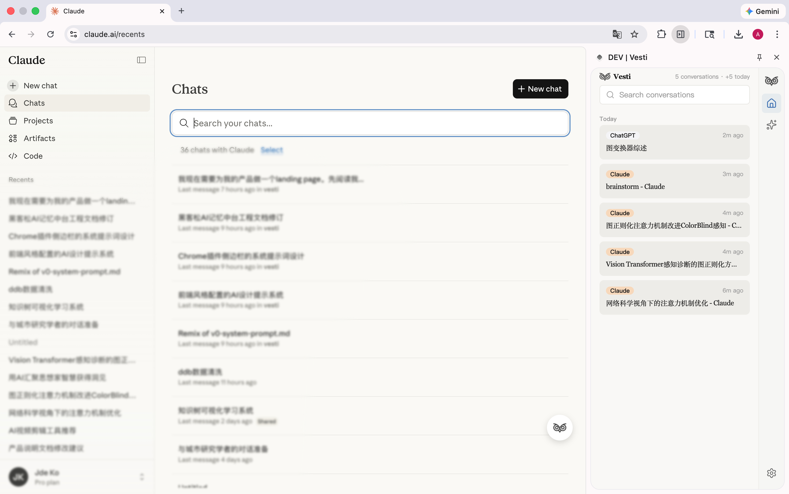



  

更新版 README.md
心迹 Vesti
本地优先的AI对话记忆中枢 | Local-First AI Conversation Memory Hub
心迹是一个Chrome浏览器扩展，帮助你捕获、组织和理解与AI的所有对话。在这个与ChatGPT、Claude等大语言模型共处的时代，我们的思考、创作和决策越来越多地发生在与AI的对话中。但这些承载着真实思维轨迹的对话记录却散落在不同平台，难以回溯、无法关联、缺乏洞察。心迹让你真正拥有自己的数字思维档案。

为什么需要心迹
当你在ChatGPT上探讨产品设计，在Claude上咨询技术方案，在Gemini上研究竞品分析时，这些思考碎片分散在不同的标签页中。一周后，当你想找回某个重要的讨论细节时，却发现自己完全记不清它在哪个平台的哪次对话里。更糟糕的是，即使找到了对话，你也很难看清这些分散的思考之间有什么关联。
心迹解决的正是这个问题。它自动捕获你在主流AI平台上的所有对话，存储在你的本地设备中，提供统一的时间轴浏览、全文检索和智能摘要。你的数据完全属于你自己，不经过任何第三方服务器。更重要的是，心迹为未来构建真正理解你的个性化AI伙伴奠定了数据基础。

核心功能
实时捕获： 当你在ChatGPT或Claude页面进行对话时，心迹在后台静默工作，自动提取对话内容并存储到本地IndexedDB。这个过程完全自动化且不可感知，无需你主动标记或导出。
统一浏览： 在浏览器侧边栏打开心迹，你可以看到按时间排列的所有对话卡片。每张卡片显示对话标题、平台标识、时间戳和消息轮数。点击任意卡片即可进入详情视图，查看完整的多轮问答流程。
全文检索： 通过搜索框输入关键词，瞬间定位到包含该词的所有对话。搜索不仅匹配标题，也匹配对话的完整内容，让你不再遗漏任何重要的思考片段。
智能摘要： 集成ModelScope API，为单个会话生成结构化摘要，快速把握对话的核心内容和关键结论。这对于回顾长对话或快速复习特定主题特别有用。
本地优先： 所有数据存储在你的本地设备中，不上传到任何云端服务器。你拥有完整的数据主权，可以随时导出、备份或删除。即使开发者也无法访问你的对话记录。

技术架构
心迹采用现代化的浏览器扩展技术栈构建，确保性能、稳定性和可扩展性。
前端框架： 基于React 18和TypeScript开发，所有组件都有严格的类型定义，消除了运行时错误的可能。UI层采用shadcn/ui组件库，确保视觉一致性和交互流畅性。
样式系统： 使用Tailwind CSS实现utility-first的样式架构，配合精心设计的色彩Token和间距系统，营造温暖克制的阅读体验。设计语言遵循Claude MCP Apps的美学标准。
扩展框架： 采用Plasmo作为Chrome扩展的开发框架，它提供了热重载、TypeScript支持和更优雅的API抽象，大幅提升了开发效率。
本地存储： 使用Dexie.js作为IndexedDB的抽象层，实现了类型安全的数据操作和高效的查询性能。所有对话数据以结构化的形式存储在浏览器本地。
捕获引擎： 设计了Parser-Observer-Storage三层架构。Observer层监听DOM变化，Parser层根据平台特性提取对话内容，Storage层负责数据持久化。三层之间通过消息传递解耦，确保了系统的可维护性。
服务层隔离： UI组件永远不直接操作数据，所有交互通过统一的服务接口进行。这意味着当我们未来引入向量数据库或云端同步时，只需要重写服务层的内部实现，UI层完全不需要改动。

快速开始
环境要求
在开始之前，请确保你的系统满足以下要求。你需要安装Node.js版本18或更高，以及pnpm包管理器。如果你还没有安装pnpm，可以通过npm全局安装它。你还需要使用Chrome浏览器或其他基于Chromium的浏览器，比如Edge或Brave。

安装步骤
首先，从GitHub仓库克隆项目代码到本地。打开终端，执行克隆命令，然后进入项目目录。接下来安装项目依赖，这个过程会下载所有必要的包。安装完成后，执行开发构建命令，Plasmo会自动编译代码并生成可加载的扩展文件。
构建成功后，你会在frontend目录下看到一个build文件夹，其中的chrome-mv3-dev子目录就是可以加载的扩展程序。打开Chrome浏览器，在地址栏输入chrome://extensions/，进入扩展管理页面。确保右上角的开发者模式已开启，然后点击左上角的"加载已解压的扩展程序"按钮，选择刚才提到的chrome-mv3-dev目录。
如果一切顺利，你会在扩展列表中看到心迹Vesti的图标。现在打开ChatGPT或Claude的网页，开始一段对话，你会发现心迹已经在后台默默工作了。点击浏览器右上角的心迹图标，或者通过侧边栏按钮打开心迹面板，你应该能看到刚才的对话已经被捕获并显示在时间轴中。

配置ModelScope API
心迹的摘要功能需要调用ModelScope的大语言模型API。要启用这个功能，你需要先获取API密钥。访问ModelScope官网并注册账号，在控制台创建新的API密钥。请妥善保管这个密钥，不要与他人分享。
在心迹的设置页面中，找到ModelScope配置区域。输入你的API密钥，并选择要使用的模型ID。我们推荐使用qwen系列模型，它们在中文理解和生成方面表现优秀。配置完成后，点击测试按钮验证连接是否成功。如果看到"连接成功"的提示，说明配置已完成。
现在你可以在任何对话详情页中点击"生成摘要"按钮，系统会调用ModelScope API分析对话内容并生成结构化摘要。生成的摘要会被缓存在本地，下次查看同一对话时无需重新生成。

使用指南
捕获对话
心迹目前支持ChatGPT和Claude两个平台的对话捕获。当你在这两个网站上进行对话时，扩展会自动监听页面变化并提取对话内容。你不需要做任何主动操作，一切都在后台自动完成。
捕获的对话包含完整的多轮问答内容、时间戳、平台标识等元数据。每个对话会被分配一个唯一的ID，即使你在不同时间访问同一个对话页面，系统也能正确识别并避免重复存储。
需要注意的是，Gemini和DeepSeek虽然在界面上有占位符按钮，但MVP版本暂时不支持这两个平台的后端捕获。这是刻意的设计决策，目的是聚焦资源打磨核心体验。后续版本会逐步添加更多平台支持。

浏览与搜索
点击浏览器工具栏上的心迹图标，或者通过侧边栏快捷方式，可以打开心迹面板。默认页面是时间轴视图，显示所有捕获的对话按时间倒序排列。每张对话卡片包含标题、平台标签、时间戳和消息轮数。
将鼠标悬停在卡片上，会展开显示对话的前100字摘要，以及编辑、打开原页面、删除等快捷操作按钮。点击卡片本身会进入详情视图，显示完整的对话历史。
在顶部搜索框中输入关键词，可以实时过滤对话列表。搜索支持标题匹配和内容全文匹配，结果会高亮显示匹配的文字。你还可以点击平台标签进行筛选，比如只查看来自ChatGPT的对话。

查看详情
在对话详情页中，消息按时间正序排列，用户消息和AI消息通过不同的背景色区分。长消息支持智能折叠，超过500字符的内容会自动收起，显示"展开全文"按钮。
将鼠标悬停在任意消息上，右上角会出现复制按钮，一键复制消息内容到剪贴板。如果消息中包含代码块，会自动应用等宽字体和语法高亮。
详情页顶部的标题栏包含返回按钮、对话标题、平台标签和消息轮数统计。点击平台标签旁边的跳转图标，可以在新标签页中打开对话的原始网页，方便你继续讨论或查看更多上下文。

生成摘要
心迹的摘要功能需要调用 ModelScope 的大语言模型 API。要启用这个功能，你需要先获取 API 密钥。访问 ModelScope 官网并注册账号，点击右上角头像进入「个人中心」，在左侧菜单点击「访问令牌」，复制以 sdk_ 或 git_ 开头的字符串，这就是你的 API 密钥。
在心迹的设置页面中，找到 ModelScope 配置区域，填入密钥。接下来选择模型 ID，请务必使用 组织名/模型名 的完整格式（如 Qwen/Qwen2.5-Coder-32B-Instruct）。我们强烈推荐使用 Qwen2.5-Coder 系列（32B 或 7B 版本），该系列在逻辑推理、代码理解及响应速度上表现优异，且 API 调用相对稳定。 配置完成后，点击测试按钮验证连接是否成功。如果看到 "连接成功" 的提示，说明配置已完成。
现在你可以在任何对话详情页中点击 "生成摘要" 按钮，系统会调用 ModelScope API 分析对话内容并生成结构化摘要。生成的摘要会被缓存在本地，下次查看同一对话时无需重新生成。

数据管理
在设置页面中，你可以查看当前的存储用量。心迹显示已使用的空间大小和浏览器分配的总配额，帮助你评估是否需要清理旧数据。
导出数据功能允许你将所有对话记录打包为JSON格式文件，下载到本地。这个功能主要用于数据备份或迁移到其他设备。导出的JSON文件包含完整的对话内容、元数据和时间戳，可以被其他工具读取和分析。
清空数据按钮会删除所有本地存储的对话记录和缓存的摘要。这是一个危险操作，执行前会弹出二次确认对话框。如果你想重新开始或者测试空白状态的界面，可以使用这个功能。

当前限制与未来规划
MVP版本的限制
当前版本是概念验证阶段的产品，有一些明确的功能边界。平台支持方面，只有ChatGPT和Claude能够实际捕获对话，Gemini和DeepSeek仅保留了UI占位符。这不是技术限制，而是资源聚焦的选择，后续会逐步扩展平台覆盖。
数据同步方面，所有数据都存储在本地浏览器中，不提供云端备份或多设备同步功能。这意味着如果你在不同的电脑上使用心迹，每台设备的数据是独立的。未来我们会提供可选的云端同步服务，但仍然坚持本地优先的原则。
AI功能方面，目前只实现了基于ModelScope API的单会话摘要。更高级的功能，比如跨对话的主题聚类、思维模式分析、主动推送相关历史等，都已经在架构设计中预留了空间，但尚未实现。这些功能需要大量的提示词工程和向量化计算，会在后续版本中逐步推出。
语言支持方面，界面和文档目前只有中文版本。虽然核心功能对英文对话同样有效，但部分UI文案和设置说明还没有国际化。我们会在用户基数扩大后考虑添加多语言支持。

短期路线图
接下来的三到六个月，我们计划实现以下功能。首先是完善平台支持，添加Gemini和DeepSeek的后端捕获能力，并探索支持更多AI工具，比如Perplexity、Poe等。
其次是引入向量化技术，将所有对话内容转换为语义向量存储在本地。这将支持真正的语义搜索——你搜索"产品设计"时，系统不仅匹配这个词本身，还能找到所有讨论用户体验、交互逻辑、功能规划的相关对话。
第三是实现跨对话的主题聚类。通过向量相似度计算，系统可以自动识别你在不同时间、不同平台上反复讨论的核心议题，生成主题图谱。你可以看到自己的思维如何在不同话题间流动，哪些问题是持续关注的，哪些是新涌现的。
第四是开发可选的云端同步功能。我们会采用端到端加密的方案，确保即使数据存储在服务器上，我们也无法解密查看。用户可以选择是否启用这个功能，默认仍然是本地优先。

长期愿景
从更长远的视角看，心迹的目标是成为个性化AI时代的记忆基础设施。当你积累了数千个对话记录后，这些数据本身就构成了一个关于你的丰富知识图谱。通过深度学习技术，系统可以识别出你独特的思维模式、决策偏好、知识盲点。
我们设想未来的心迹能够主动推送相关记忆。当你在思考某个问题时，系统检测到话题，自动从历史对话中提取相关片段形成上下文摘要。你不需要主动搜索，系统在恰当的时机提醒你"你曾经思考过这个"。
更激进的愿景是训练一个完全基于你个人对话数据的语言模型。这个模型不仅理解你说的话，更理解你为什么这么说、你的潜在意图是什么、你可能会遇到什么困难。它不是通用的AI，而是真正属于你的数字思维伙伴。
这些愿景的实现需要大量的技术积累和算力投入，但心迹的架构设计已经为这些可能性铺平了道路。MVP阶段的工程决策不是为了快速搭建demo,而是为了建造一个可以持续生长的系统。

贡献指南
心迹是一个开源项目，我们欢迎任何形式的贡献。如果你在使用过程中发现bug或有功能建议，请在GitHub Issues中提交详细描述。如果你想贡献代码，可以fork仓库并提交Pull Request。
在提交代码前，请确保通过TypeScript类型检查，并遵循项目的代码风格规范。我们使用Prettier进行代码格式化，使用ESLint进行语法检查。所有提交的代码都应该有清晰的注释和类型定义。
如果你想参与产品设计讨论或分享使用心得，欢迎加入我们的社区频道。我们相信最好的产品是与用户共同创造的，你的反馈将直接影响心迹的发展方向。

许可证
心迹采用MIT许可证开源。你可以自由使用、修改和分发这个项目，只需保留原始的版权声明。我们相信开源精神与数据主权的理念是一致的——软件应该服务于人,而非控制人。

致谢
心迹的诞生离不开开源社区的贡献。我们使用了Plasmo、Dexie.js、Tailwind CSS、shadcn/ui等优秀的开源项目,感谢这些工具的开发者。我们也感谢Claude Code和Codex在产品设计和代码开发过程中提供的协助,这个项目本身就是人机协作的成果。
最重要的是,感谢每一位使用心迹的用户。你们的对话数据是私密的思维轨迹,选择信任我们的产品意味着很大的信心。我们承诺始终坚持本地优先的原则,让数据主权牢牢掌握在你们手中。
心迹 Vesti —— 让思维有迹可循
